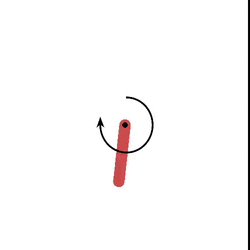

# DDPG-paper-implementation
Implementation of [Continuous control with deep reinforcement learning](https://arxiv.org/abs/1509.02971) paper together with [Stochastic Weighted Average](https://arxiv.org/abs/1803.05407) ([using pytorch](https://pytorch.org/blog/stochastic-weight-averaging-in-pytorch/)) for a better stability

### File descriptions:
1. `DDPG.py` - main file where DDPG traning, testing and plotting results is defined. Current version uses torchcontrib’s SWA version, SWA_start variable is set in timestep units. 
2. `utils.py` - utils classes and functions. Main utils:
    * ReplayBuffer - List of all past states and their information ('state', 'action', 'next_state', 'reward', 'terminal')
    * OU_Noise - Ornstein–Uhlenbeck process noise
3. `requirements.txt` - python dependencies. Install by using `pip install -r /path/to/requirements.txt`

### Encountered issues:
* I’m using mixture of Adam and SWA, setting SWA to 1/5th learning rate of Adam in the moment of swapping, I haven’t yet tested with SGD, since convergences time takes ages 
* Unable to normalize self-implemented SWA due to being unable to connect DataLoader function together with the gym environment 

### Further improvements: 
There is still a lot of room for improvement, further testing and fine-tunning some of them include:
* Using different optimizers: Adam/SGD/AdaGrad with different learning rates & learning rate decays
* learning rate decays based on current convergence
* Swapping SWA weights and continuing the training
* Using different type Noise
* Changing the size of the buffer to smaller over time so that we only experience the most recent states 
* Different neural network weight initializations, layer sizes, Actor/Critic architecture (more research on the impact of size/number of hidden layers to be conducted)
